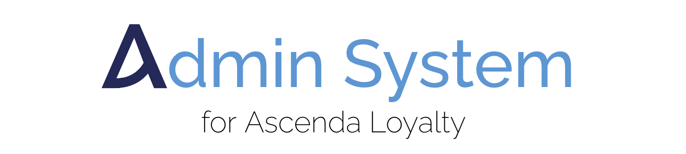
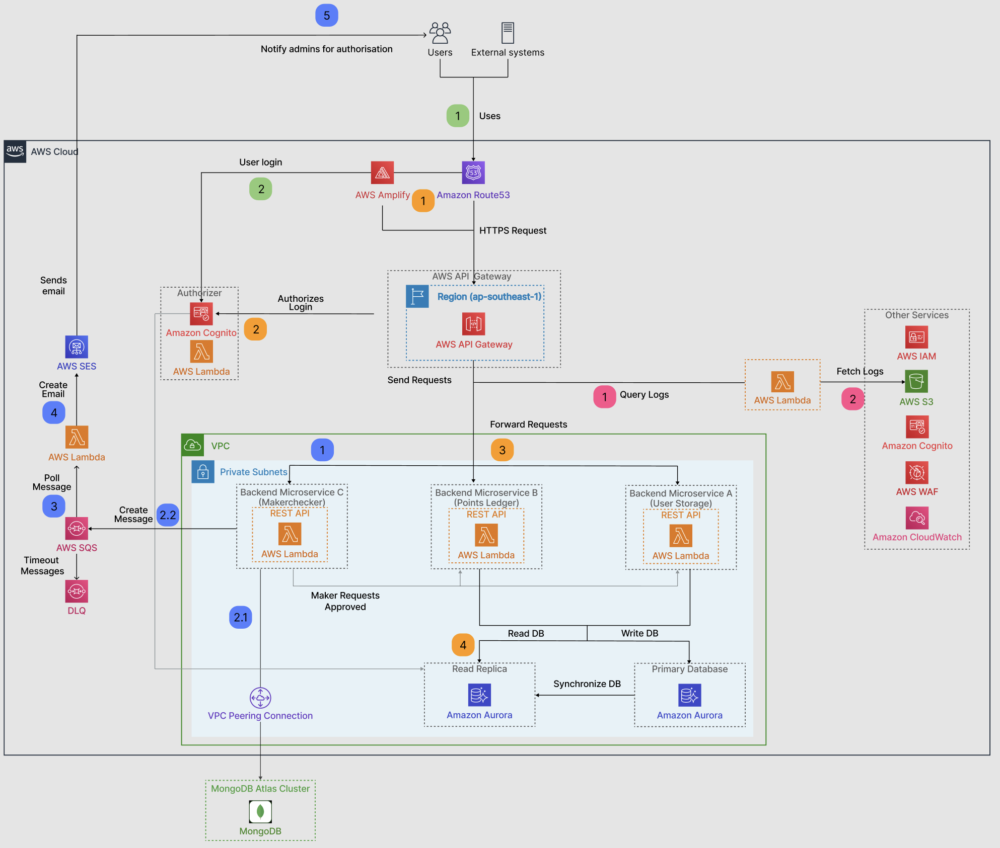

# G3T3 Admin Portal
</img>

## Description
This Admin Portal built for Ascenda Loyalty is a highly scalable and highly available solution for internal admin staff to handle users and their points accounts. We mainly utilised a serverless architecture to deploy our microservices as AWS Lambda Functions.

## Solution Architecture

</img>

## Submodules

This repository consist of the following services linked as submodules:

- `frontend` - Web Application built with Next.js that serves users.
- `authentication_lambda` - Customised Lambda authentication service for Role-Based Access Control.
- `email_service` - An emailing service that communicates with SES that is built in Python.
- `logs-lambda` - A microservice for logging related activity that is built in Python.
- `maker-checker` - A microservice REST API for makerchecker that is built using Golang with the Gin framework.
- `points-ledger` - A microservice REST API for points that is built using Golang with the Gin framework.
- `user-storage` - A microservice REST API for users that is built using Golang with the Gin framework.
- `infra` - Terraform code to set up base infrastructure of our current architecture. Also contains k6 test scripts.

## Dependencies

This project has the follow dependencies:

- Submodules referenced
- [Terraform](https://developer.hashicorp.com/terraform/downloads?product_intent=terraform)

## Cloning the project

This project contains submodules, to ensure that the submodules are clone properly, run the clone command with the `--recurse-submodules` flag:

```bash
git clone --recurse-submodules <repository-url>
```

## Testing the current setup

To try out the final product of our Admin Portal system:-
1. Head over to the website: [www.itsag3t3.com](https://www.itsag3t3.com)
2. Ensure that you have a Gmail account set up, and login.
3. Navigate and play around the functions!

## Setting up

This current system is implemented on AWS Cloud, utilising the AWS Serverless Computing services like AWS Lambda, AWS RDS Aurora, AWS S3.

To setup, we have provided an Terraform codes for setting up the base infrastructure that we are currently using in `infra`. Additionally, we have provided Terraform codes for our backend services for `maker-checker`, `points-ledger`, and `user-storage`.

Do note that additional configuration may be needed to get te services working.

### Environment variables

Inside each submodule repositories, please take note that all submodules associate with this project will also have their own `env.example` files that need to be copied, renamed and modified.
